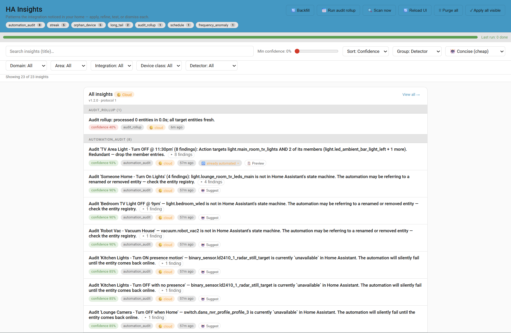
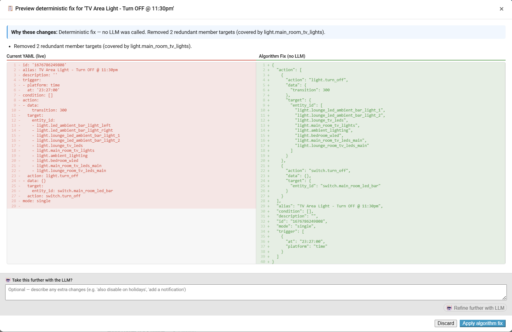
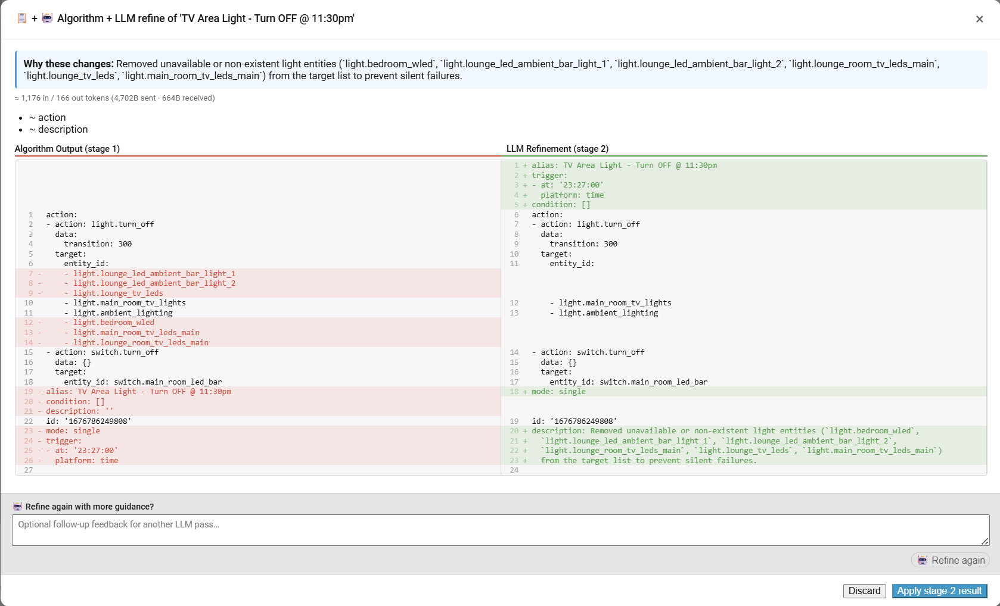
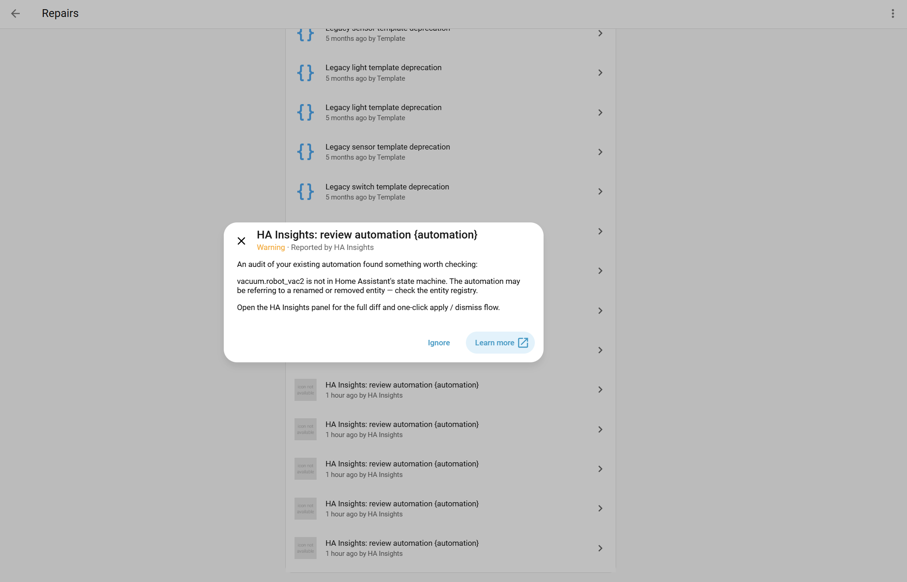
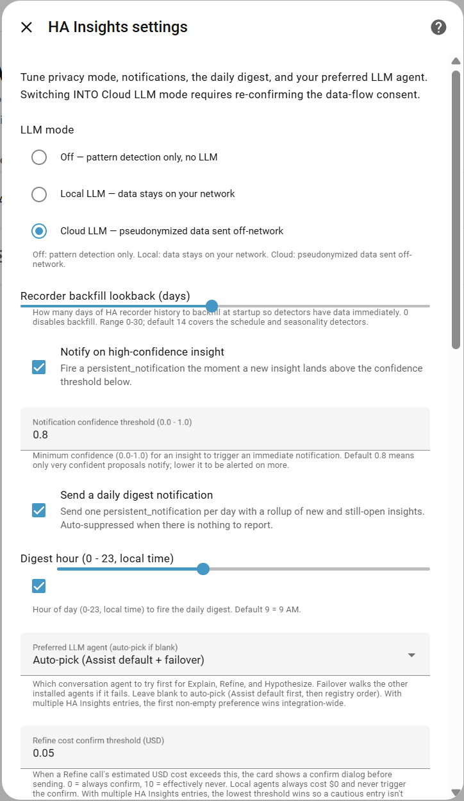

# HA Insights for Home Assistant

> *Proactive pattern detection + AI-assisted automation auditing for Home Assistant. Watches your home, finds bugs in the automations you've already written, and suggests fixes.*


---

## What it does

**Two modes**, both work without any LLM:

### 1. Audit your existing automations (NEW in v1.1)

Reads every automation you've written and tells you what's wrong with it. Findings come from HA's own data — entity registry, automation execution traces, and 90 days of state history:

- **Entity unavailable / missing** — your automation references entities HA can't find anymore (renamed, removed, integration gone)
- **Long-stay duration** — light stays on 271 min on average; your `for: 60` is too tight
- **Redundant target** — action targets both `light.living_group` AND `light.living_lamp_1` (member). Drop one
- **Trigger drift** — `at: '07:00'` but observed transition averages 07:08 across 14 days. Shift the trigger
- **Condition too strict** — the automation triggered 184× but a condition blocked 142 of them. Maybe relax it
- **Action errors** — actions are throwing exceptions on N% of runs
- **Dormant** — hasn't fired in 60+ days; possibly broken or unneeded
- **Seasonal patterns** — only fires Nov-Mar (90-day rollup); add a `month:` condition if trigger is time-based

Each finding either:
- Ships with a **📋 Preview** button that shows the deterministic YAML fix in a side-by-side diff (no LLM, no tokens) — Apply commits it
- Ships with a **🤖 Suggest** button when there's no algorithmic fix — the LLM is given an explicit AUTHORIZED EDITS list of what the findings actually justify
- Both: **🤖 Refine further with LLM** layers LLM ideas on top of the deterministic stage

### 2. Discover patterns in your home

Eight built-in detectors watch state history and surface routines you might want to automate:

| Detector | What it finds |
|---|---|
| **Schedule** | "Every weekday at ~6:47 AM you turn on `light.kitchen`" |
| **Seasonality** | "Every Friday at ~7 PM, movie lights go on" (weekly cycles) |
| **Cooccurrence** | "Within 5s of the front door opening, the porch light turns on" |
| **LaggedCorrelation** | "Garage opens, driveway light follows ~3 min later" |
| **LongTail** | "Bathroom fan stayed on 4h, 12 times this fortnight" |
| **Streak** | "Light X turns on 3 days in a row at ~22:15" |
| **OrphanDevice** | "`binary_sensor.front_door` hasn't reported in 11 days" |
| **FrequencyAnomaly** | "Front door fired 50× today (~2/day baseline)" |

Cohort detection collapses 35 NVR cameras silent for 8 days into a single row, not 35 separate insights.

Click **Apply** and it writes a real `automation:` block to `automations.yaml`. **Undo** within 7 days reverses cleanly with drift detection.

---

## Screenshots

> _Captured on a 1000-entity HA install running v1.2.0._

| | |
|---|---|
|  | **Main panel.** Detector count chips, filter dropdowns, per-row context (🔌 integration, 🏷️ external-app, 🔁 already-automated, age). Audit and discovery insights mixed on one surface. |
|  | **📋 Preview deterministic fix.** Side-by-side IDE-style diff (LCS line alignment). Zero LLM tokens — algorithm computed the fix from the redundant_target observation. |
|  | **🤖 Algorithm + LLM Refine.** Stage 2 layers LLM iteration on top of the algorithm output. The "Refine again with more guidance" textarea drives multi-turn refinement. |
|  | **Standard HA Repairs page.** v1.2 dual-emits audit findings into HA's official issue registry, so users discover them via native UI without needing the panel open. |
|  | **OptionsFlow.** Privacy mode, daily digest, audit window, audit verbosity, monthly cloud-LLM budget, auto-rollup scheduler. Everything configurable from Settings → Devices & Services. |

---

## Architecture in one diagram

```
┌─────────────────────────────────────────────────────────────────────────┐
│                          HA Insights Pipeline                            │
└─────────────────────────────────────────────────────────────────────────┘

       HA event bus + recorder + automation registry
                          │
                          ▼
     ┌──────────────────────────────────────────────┐
     │  Detectors run on a buffer snapshot           │
     │  • schedule, streak, cooccurrence, etc.      │
     │  • automation_audit (NEW — reads existing    │
     │    YAMLs + traces + rollups)                  │
     │  Pure-Python; thread-safe; no I/O on loop    │
     └────────────────────┬─────────────────────────┘
                          │ Insight objects
                          ▼
     ┌──────────────────────────────────────────────┐
     │  SQLite store + display-time dedup (cohorts)  │
     │  + Repairs registry sync (dual-emit)         │
     └────────────────────┬─────────────────────────┘
                          │ ws_list / subscribe events
                          ▼
     ┌──────────────────────────────────────────────┐
     │  ha-insights-card (Lit element)              │
     │  • Panel + Lovelace card                     │
     │  • Filter chips, group-by, expand cohorts    │
     │  • Side-by-side diff modal                   │
     │  • Apply / Refine / Suggest buttons          │
     └──────────────────────────────────────────────┘

   LLM only fires on user action — not in the scan loop.
   When it fires, goes through:
     Redactor (pseudonymize) → Conversation API → audit log
     → reverse-dereference → validator → apply pipeline
```

---

## Privacy posture

- **OFF mode** — zero outbound network. Pattern detection runs locally.
- **LOCAL mode** — pseudonymized data goes to a local Conversation agent (Ollama, Piper). Stays on your network.
- **CLOUD mode** — pseudonymized data goes to a cloud agent (Claude, GPT, Gemini). Real entity_ids never leave — they're replaced with stable pseudonyms (`light.entity_a3f1b2`) before any LLM call. Reverse-mapped on response.

Per-entity opt-out blocks specific entities from EVER being sent (not even pseudonymized). Every outbound call is logged with bytes / agent / cost / success. The **"What gets sent?"** modal previews the exact payload before any LLM action.

Full details: [`docs/privacy.md`](docs/privacy.md).

---

## v1.1 highlights

- **AutomationAuditDetector** — audits every automation you've written. Eight kinds of findings, deterministic fixes available for half, LLM refinement for the rest.
- **Side-by-side LCS diff modal** — IDE-style aligned rows with red `-` / green `+` gutters. Phone-responsive (panes stack vertically below 720px).
- **Two-stage refinement** — deterministic fix first (free, instant), then optionally layer LLM iteration on top with an extra user-feedback box.
- **Repairs registry dual-emit** — audit findings appear in HA's standard `Settings → Repairs` page alongside HA's own issue notifications. Users discover the integration even when they forget the panel exists.
- **Concise vs In-depth toggle** — top-of-panel switch trades LLM cost vs reasoning depth. Concise (~700 token prompts) is the default; In-depth (~1200 token prompts) for tricky automations.
- **AUTHORIZED EDITS per-call** — instead of universal rules the LLM must obey, each refine ships an explicit list of changes the findings or user request authorise. LLM can't invent removals the audit didn't justify.
- **Token usage row** — every refine modal shows approximate in/out token counts so you know exactly what each call cost.
- **24 unit tests** covering dedup, audit packet builders, deterministic fix builders. Run via `pytest tests/test_lib_dedup.py tests/test_audit_packet.py tests/test_audit_fixes.py`.

Full plan + design notes: [`docs/AUTOMATION_AUDIT_PLAN.md`](docs/AUTOMATION_AUDIT_PLAN.md)

---

## Install

### Integration

1. **HACS → Integrations → ⋮ → Custom repositories**
2. Add `https://github.com/botts7/ha-insights` as type **Integration**
3. Click **Install** on "HA Insights"
4. Restart Home Assistant
5. **Settings → Devices & Services → Add Integration → "HA Insights"**
6. Walk the wizard — pick the privacy mode that fits. Off works fully without an LLM; Local / Cloud light up Refine + Suggest + Explain.

### Card

The card repo is [ha-insights-card](https://github.com/botts7/ha-insights-card) — render insights as a Lovelace card AND mount the sidebar panel.

1. **HACS → Frontend → ⋮ → Custom repositories**
2. Add `https://github.com/botts7/ha-insights-card` as type **Lovelace**
3. Install
4. The integration auto-registers a sidebar **Insights** panel at `/ha-insights` once the card resource loads
5. For a dashboard tile too:
   ```yaml
   type: custom:ha-insights-card
   compact: true
   ```

### Optional: LLM Conversation agent

Refine + Suggest + Explain need a Conversation integration. Pick from HA's standard options:
- **Ollama** (local, free)
- **Anthropic Conversation** (Claude — best output quality for YAML)
- **OpenAI Conversation** (GPT-4 / GPT-5)
- **Google Generative AI Conversation** (Gemini — make sure `max_output_tokens` is set high enough; default 150 is too low)
- **Nabu Casa Cloud** (Assist subscription)

The integration auto-picks the first installed LLM agent. Override per-call via the UI's preferred-agent dropdown.

---

## How the audit works end-to-end

1. Every scan, the **AutomationAuditDetector** walks every automation it can find (`automations.yaml`, `configuration.yaml`, packages, runtime registry).
2. For each automation, it builds an **AuditPacket**:
   - Live state-machine snapshot (HA `states`) — for entity_silent
   - 14-day event buffer aggregates — for long_on_duration, trigger_time_drift
   - HA's own **automation traces** (last N runs) — for trace_dormant, trace_condition_blocks, trace_action_errors
   - 90-day recorder rollups (day-of-week / day-of-month / month-of-year) — for seasonal patterns
   - Cross-reference to other detector findings touching the same entities
3. Each observation feeds into a per-kind hint that gets shown alongside the finding.
4. **Findings that have a deterministic fix** (redundant_target, long_on_duration, trigger_time_drift) ship with `payload_format="automation"` + a 📋 Preview button. No LLM tokens spent.
5. **Findings without a deterministic fix** (entity_silent, trace_*, rollup_*) ship as `payload_format="report"` with a 🤖 Suggest button.
6. Clicking 🤖 sends through HA's Conversation API with: the YAML, the observations, and an `AUTHORIZED EDITS:` block explicitly listing which changes the findings justify.
7. The card renders the LLM's refined YAML as a side-by-side aligned diff. Apply commits via the existing validator + writer.

---

## Cost economics

For a typical 30-automation home with the v1.1 prompt:

| Action | Tokens (approx) | Notes |
|---|---|---|
| Scan + emit audit insights | 0 | Pure-Python detectors, no LLM |
| 📋 Preview deterministic fix | 0 | Algorithm runs offline |
| 🤖 Suggest, Concise depth | ~700 in / ~150-400 out | ~$0.0008-0.002 on Sonnet |
| 🤖 Suggest, In-depth | ~1200 in / ~150-400 out | 4× input for tricky automations |
| 🤖 Refine further (stage 2) | ~700 in / ~150-300 out | Concise enforced regardless of setting |
| Local LLM (Ollama, etc.) | n/a | $0; no budget gate fires |

A per-month USD budget can be set in OptionsFlow for cloud agents; the background batch suggest service stops queuing once the cap is hit.

---

## Companion docs

- [`docs/ARCHITECTURE.md`](docs/ARCHITECTURE.md) — full architectural charter
- [`docs/AUTOMATION_AUDIT_PLAN.md`](docs/AUTOMATION_AUDIT_PLAN.md) — v1.1 design + phases
- [`docs/PHASE_6_VALIDATION.md`](docs/PHASE_6_VALIDATION.md) — pre-release regression matrix
- [`docs/privacy.md`](docs/privacy.md) — what's stored / what isn't / how to wipe
- [`docs/ws-api.md`](docs/ws-api.md) — stable WebSocket API contract
- [`docs/writing-a-detector.md`](docs/writing-a-detector.md) — community detector contribution guide

---

## Position vs HA's built-in Assist

[Assist](https://www.home-assistant.io/voice_control/) is **reactive** — user asks, LLM answers and can act. HA Insights is **proactive** — observes patterns + audits existing automations + surfaces actionable suggestions, optionally refined with the same LLM agent you've configured for Assist. Same agents, complementary surfaces.

---

## Branding

"HA Insights" is a community project, not affiliated with or endorsed by Nabu Casa. "Home Assistant" is a Nabu Casa trademark; we follow the standard HACS-community pattern of `ha-` prefixed naming and don't use HA brand assets.

## License

MIT — see [`LICENSE`](LICENSE).
